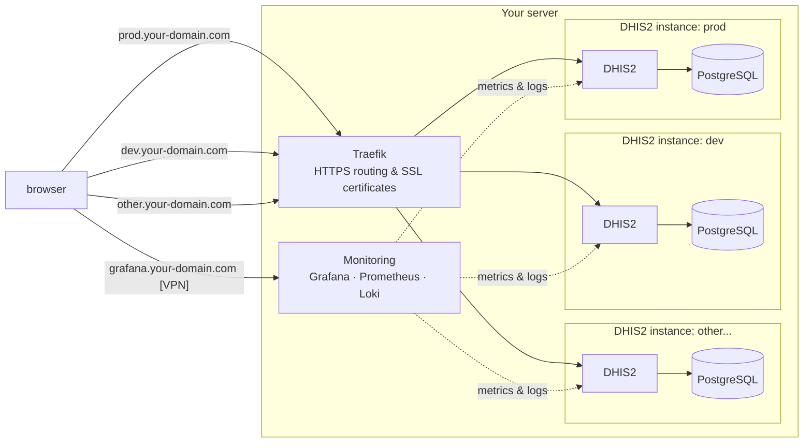
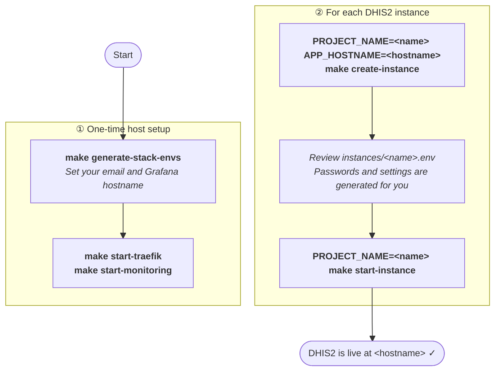
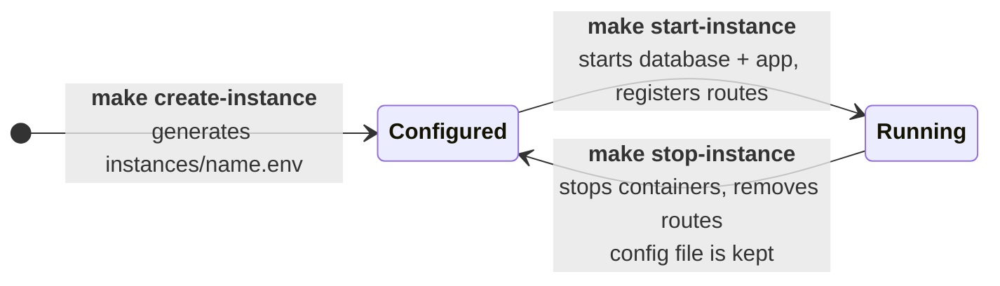

# Docker Deployment

> [!CAUTION]
> **Ready for public testing — NOT yet recommended for production or critical data**
>
> This project is available for public testing and evaluation, but it remains immature and is not recommended for production use yet. The implementation has been designed to meet production standards, however it needs additional testing, stabilization, and a small set of features before we can recommend it for critical data.
>
> Key points:
>
> - The primary limitation is overall maturity — more real-world testing and validation are required.
> - Direct database access and advanced operations require technical knowledge.
> - Tuning and optimisation (postgresql, DHIS2 and container resource allocation) is needed per deployment
>
> We explicitly do NOT recommend using this for production at this time because of the project's current maturity level. With continued development, testing (**with feedback from the community**), and configuration, the project is intended to meet production requirements.

## Overview

This repository provides a Docker-based deployment for the DHIS2 application, designed for both local development/testing and secure production implementations. It supports running multiple named DHIS2 instances on the same host, each with its own PostgreSQL database, isolated Docker networks, and automatically registered Traefik routes and Prometheus scrape targets.

The stack is orchestrated through `make` targets using Docker Compose. Traefik (reverse proxy) and a monitoring stack (Grafana, Prometheus, Loki) are launched once per host and shared across all instances.



> [!WARNING]
> If you are upgrading from a previous version of this tool and have a `.env` file in the root of the repository, please remove it! Otherwise it may interfere with the new project-based deployment mechanism.

## Table of contents

<!-- START doctoc generated TOC please keep comment here to allow auto update -->
<!-- DON'T EDIT THIS SECTION, INSTEAD RE-RUN doctoc TO UPDATE -->

- [Quick Start](#quick-start)
- [Deployment For Production](#deployment-for-production)
  - [Deployment Prerequisites](#deployment-prerequisites)
  - [One-time server setup](#one-time-server-setup)
  - [Create an instance](#create-an-instance)
  - [Start an instance](#start-an-instance)
  - [Manage multiple instances](#manage-multiple-instances)
  - [Stop an instance](#stop-an-instance)
- [Advanced Usage](#advanced-usage)
  - [PostgreSQL Configuration](#postgresql-configuration)
  - [Additional Services (Overlays)](#additional-services-overlays)
    - [Traefik Dashboard](#traefik-dashboard)
    - [Glowroot](#glowroot)
    - [Profiling (Tracing with Tempo)](#profiling-tracing-with-tempo)
    - [VPN Access (WireGuard)](#vpn-access-wireguard)
  - [Backup and Restore](#backup-and-restore)
    - [Backup](#backup)
    - [Backup Timestamp](#backup-timestamp)
    - [Restore](#restore)
  - [Let's Encrypt Certificate Management](#lets-encrypt-certificate-management)
    - [Production vs Staging](#production-vs-staging)
  - [Monitoring](#monitoring)
    - [Prerequisites](#prerequisites)
    - [Monitoring Deployment](#monitoring-deployment)
    - [DHIS2 Monitoring](#dhis2-monitoring)
    - [Accessing Monitoring Services](#accessing-monitoring-services)
    - [Configuration](#configuration)
- [Contributing to this project](#contributing-to-this-project)
  - [Prerequisites](#prerequisites-1)
  - [Start all services](#start-all-services)
  - [Clean all services](#clean-all-services)
  - [Run end-to-end tests](#run-end-to-end-tests)
- [Further Documentation](#further-documentation)
- [Community & Discussions](#community--discussions)

<!-- END doctoc generated TOC please keep comment here to allow auto update -->

## Quick Start

This section is for users who want to quickly set up and test the DHIS2 application on their local machine.



```shell
# Clone the repository
git clone https://github.com/dhis2/docker-deployment.git && \
  cd docker-deployment

# One-time host setup: configure and launch Traefik and the monitoring stack
GEN_LETSENCRYPT_ACME_EMAIL=whatever@dhis2.org \
GEN_GRAFANA_HOSTNAME=grafana.127-0-0-1.nip.io \
  make generate-stack-envs

make start-traefik &
make start-monitoring &

# Create and launch a DHIS2 instance (called "prod")
APP_HOSTNAME=dhis2.127-0-0-1.nip.io PROJECT_NAME=prod make create-instance
PROJECT_NAME=prod make start-instance
```

Open [http://dhis2.127-0-0-1.nip.io](http://dhis2.127-0-0-1.nip.io) in your favorite browser.

> [!NOTE]
> Your browser will warn you that the certificate is not trusted. This is expected, as it is a self-signed certificate.
>
> For local testing without real DNS, [nip.io](https://nip.io) provides free wildcard DNS that resolves to an embedded IP address — for example, `dhis2.127-0-0-1.nip.io` resolves to `127.0.0.1` with no configuration required.

> [!NOTE]
> The default DHIS2 admin credentials are available in `instances/prod.env`.

## Deployment For Production

This section is for users planning to deploy DHIS2 in a production environment.

### Deployment Prerequisites

Before deploying to production, ensure you have:

- A dedicated host or virtual machine with Docker and Docker Compose installed.
- A fully qualified domain name (FQDN) for each DHIS2 instance you plan to run.
- A valid email address for Let's Encrypt certificate management.
- Appropriate firewall rules configured for ports 80 and 443.

> [!NOTE]
> A wildcard DNS record (`*.your-domain.com`) pointing to your server is a convenient way to cover all instances with a single DNS entry — each instance then gets its own subdomain (e.g. `prod.your-domain.com`, `dev.your-domain.com`).
>
> You can also namespace instances under a shared subdomain: add an A record for `dhis2.your-domain.com` and a wildcard `*.dhis2.your-domain.com`, then host `prod` at `dhis2.your-domain.com` and additional instances at `dev.dhis2.your-domain.com`, `test.dhis2.your-domain.com`, etc. Note that a wildcard does not match the bare subdomain it is rooted at, so the explicit A record for `dhis2.your-domain.com` is required alongside the wildcard.
>
> For local testing without real DNS, [nip.io](https://nip.io) can also be used, as mentioned earlier.

### One-time server setup

Run these commands once per host before creating any instances. They generate environment files for the shared Traefik and monitoring stacks, then start both.

```shell
GEN_LETSENCRYPT_ACME_EMAIL=your@email.com \
GEN_GRAFANA_HOSTNAME=grafana.your-domain.com \
  make generate-stack-envs

COMPOSE_OPTS=-d make start-traefik
COMPOSE_OPTS=-d make start-monitoring
```

`COMPOSE_OPTS=-d` runs both stacks in detached mode. Traefik watches `stacks/traefik/conf.d/` for route changes; Prometheus watches `stacks/monitoring/targets/` for new scrape targets — both pick up new instances automatically without a restart.

### Create an instance

Generate the environment file for a named instance. `PROJECT_NAME` is a short identifier (e.g. `prod`, `dev`, `test`, `one`, `two`,...) that is used as the Docker Compose project name and must be unique on the host.

```shell
APP_HOSTNAME=<name>.<your-domain.com> PROJECT_NAME=<name> make create-instance
```

This writes `instances/<name>.env` with generated passwords and the supplied hostname. Review and adjust that file before launching — see the [environment variables documentation](docs/environment-variables.md) for details on each variable.

You can create multiple instances in this way, by simply using different names for each.

You can list your instances at any time:

```shell
make list-instances
```

### Start an instance

Start an instance by targeting that named instance with the `PROJECT_NAME` variable:

```shell
PROJECT_NAME=<name> make start-instance
```

This will:

1. Create a dedicated `<name>-db` Docker network for database isolation.
2. Start a PostgreSQL container for the instance and wait until it is healthy.
3. Register the instance's hostname with Traefik by writing `stacks/traefik/conf.d/<name>.yml`.
4. Register Prometheus scrape targets for the app and database.
5. Start the DHIS2 application container.

> [!NOTE]
> The first time you launch an instance it will initialise with a blank database. If you have an existing database, you can restore it following the [Backup and Restore](#backup-and-restore) section below.

### Manage multiple instances

Additional instances can be created and launched independently. Each instance is fully isolated with its own database, network, and monitoring targets.

```shell
# Add a second instance
APP_HOSTNAME=dev.your-domain.com PROJECT_NAME=dev make create-instance
PROJECT_NAME=dev make start-instance
```

To see all configured instances and their running container counts:

```shell
make list-instances
```

### Stop an instance

Stopping an instance brings down its containers and removes its Traefik routes and Prometheus targets. The `instances/<name>.env` file is retained so the instance can be relaunched later.

```shell
PROJECT_NAME=<name> make stop-instance
```

The diagram below summarises all possible states for an instance and the commands that move between them:



## Advanced Usage

### PostgreSQL Configuration

For production environments, careful configuration of PostgreSQL is critical for performance and stability.

Custom configuration for PostgreSQL should be done by adding `.conf` files to the `./config/postgresql/conf.d/` directory. Create new files for specific settings rather than modifying existing ones or `config/postgresql/postgresql.conf`.

Any changes to these files will require a restart of the PostgreSQL container to take effect. For changes to take effect without restarting the container, you can execute (inside the PostgreSQL container):

```sql
SELECT pg_reload_conf();
```

### Additional Services (Overlays)

Deployments can benefit from additional services provided by compose overlays. Pass overlays via `COMPOSE_OPTS` or by setting them directly in the compose command.

#### Traefik Dashboard

To enable the Traefik dashboard for local monitoring of your reverse proxy, launch the application with the following command:

```shell
docker compose -f docker-compose.yml -f overlays/traefik-dashboard/docker-compose.yml up
```

#### Glowroot

Glowroot is an APM (Application Performance Monitoring) tool that can be enabled to monitor the DHIS2 application's performance in production.

```shell
docker compose -f docker-compose.yml -f overlays/glowroot/docker-compose.yml up
```

#### Profiling (Tracing with Tempo)

The profiling overlay adds distributed tracing capabilities using Grafana Tempo and OpenTelemetry. This allows you to trace requests through the DHIS2 application, providing insights into performance bottlenecks and request flows.

> [!NOTE]
> The profiling overlay requires the monitoring stack to be running first (`make start-monitoring`).

```shell
PROJECT_NAME=<name> COMPOSE_OPTS="-f overlays/profiling/docker-compose.yml" make start-instance
```

For detailed configuration and usage, see the [Profiling Overlay README](overlays/profiling/README.md).

#### VPN Access (WireGuard)

The WireGuard overlay adds a VPN endpoint so authorised clients can reach admin and monitoring UIs (Grafana, Glowroot) over a private tunnel using `*.internal` hostnames, without exposing those services publicly.

```shell
make launch-vpn
```

| Hostname            | Service     |
| ------------------- | ----------- |
| `grafana.internal`  | Grafana     |
| `glowroot.internal` | Glowroot    |

For client setup, certificate trust, and full configuration reference, see [docs/vpn.md](docs/vpn.md).

### Backup and Restore

Robust backup and restore procedures are essential for production. Backups are stored in the `./backups` directory. We support backup and restore of both the database and the file storage.

All backup and restore commands require `PROJECT_NAME` to target the correct instance.

#### Backup

A complete backup of both the database and file storage can be created by executing:

```shell
PROJECT_NAME=<name> make backup
```

This command will create two files in the `./backups` directory: one for the database and one for the file storage.

- **Backup Database**: The database can be backed up in `custom` (default) or `plain` format, controlled by the `POSTGRES_BACKUP_FORMAT` environment variable.

    ```shell
    PROJECT_NAME=<name> make backup-database
    ```

    This creates a file in `./backups` named `$TIMESTAMP.pgc` (custom) or `$TIMESTAMP.sql.gz` (plain). Consult the [PostgreSQL documentation](https://www.postgresql.org/docs/current/app-pgdump.html) for more details.

- **Backup File Storage**:

    ```shell
    PROJECT_NAME=<name> make backup-file-storage
    ```

#### Backup Timestamp

By default, backups are automatically named with a timestamp in the format `YYYY-MM-DD_HH-MM-SS_UTC`. You can override this by setting the `BACKUP_TIMESTAMP` environment variable when running backup commands:

```shell
PROJECT_NAME=<name> BACKUP_TIMESTAMP=<custom-backup-timestamp> make backup
```

#### Restore

The restore process relies on the `DB_RESTORE_FILE` and `FILE_STORAGE_RESTORE_SOURCE_DIR` environment variables, which must be set to the path of the backup file/directory to restore (without the `./backups` prefix).

A complete restore of both database and file storage can be done by executing:

```shell
PROJECT_NAME=<name> make restore
```

- **Restore Database**: Set the `DB_RESTORE_FILE` environment variable to the backup file name.

    ```shell
    PROJECT_NAME=<name> make restore-database
    ```

- **Restore File Storage**: Set the `FILE_STORAGE_RESTORE_SOURCE_DIR` environment variable to the backup directory name.

    ```shell
    PROJECT_NAME=<name> make restore-file-storage
    ```

### Let's Encrypt Certificate Management

#### Production vs Staging

- **Production (default):** trusted certificates with standard Let's Encrypt rate limits.
- **Staging:** untrusted test certificates with much higher rate limits for validation and CI/testing workflows.

To use staging, set this in `stacks/traefik/.env`:

```dotenv
LETSENCRYPT_ACME_CASERVER=https://acme-staging-v02.api.letsencrypt.org/directory
```

### Monitoring

The monitoring stack provides visibility into the health and performance of all running DHIS2 instances. It includes Grafana, Loki, and Prometheus for logs and metrics collection and is launched once per host, shared across all instances.

#### Prerequisites

The Docker Loki Driver plugin is required to forward container logs to Loki. It is installed automatically when launching an instance, but can also be installed manually:

```shell
./scripts/install-loki-driver.sh
```

#### Monitoring Deployment

The monitoring stack is launched as part of the one-time server setup:

```shell
COMPOSE_OPTS=-d make start-monitoring
```

This deploys:

- **Grafana**: A web-based monitoring and visualization platform with preloaded dashboards for Traefik, PostgreSQL, and server/host data.
- **Prometheus**: Collects metrics from each DHIS2 instance (`/api/metrics`) and its Postgres Exporter. New instances are picked up automatically via file-based service discovery in `stacks/monitoring/targets/`.
- **Loki**: Aggregates all container logs (DHIS2, PostgreSQL, Traefik) via the Docker Loki Driver plugin. Logs are indexed by labels for efficiency.

#### DHIS2 Monitoring

DHIS2's built-in monitoring API is enabled, exposing health and performance metrics to Prometheus.

#### Accessing Monitoring Services

1. Ensure the monitoring stack is running (`make start-monitoring`).
2. Open `https://<GEN_GRAFANA_HOSTNAME>` in your browser (the hostname configured during server setup).
3. Login with:
    - Username: `admin`
    - Password: Check `stacks/monitoring/.env` for `GRAFANA_ADMIN_PASSWORD`.

#### Configuration

Monitoring settings can be configured via environment variables in `stacks/monitoring/.env`:

- `GRAFANA_ADMIN_PASSWORD`: Grafana admin password (auto-generated).
- `PROMETHEUS_RETENTION_TIME`: Prometheus data retention (default: `15d`).
- `LOKI_RETENTION_PERIOD`: Loki log retention (default: `744h` = 31 days).

## Contributing to this project

This section is for developers who want to contribute to this project.

### Prerequisites

- Python 3.11+
- Pip
- Make

To initialize the development environment:

```shell
make init
```

### Start all services

To start all services for development, follow the same flow as production using local `nip.io` hostnames:

```shell
GEN_LETSENCRYPT_ACME_EMAIL=dev@dhis2.org \
GEN_GRAFANA_HOSTNAME=grafana.127-0-0-1.nip.io \
  make generate-stack-envs

make start-traefik &
make start-monitoring &

APP_HOSTNAME=dhis2.127-0-0-1.nip.io PROJECT_NAME=dev make create-instance
PROJECT_NAME=dev make start-instance
```

### Clean all services

To stop and remove a development instance and its associated data:

```shell
PROJECT_NAME=dev make stop-instance
```

To destroy all Docker volumes (database, file storage, monitoring data) for a full reset:

```shell
PROJECT_NAME=dev make clean-all
```

### Run end-to-end tests

```shell
make test
```

Note that the environment needs to be "fresh" for the end-to-end tests' expectations to succeed, so it's advised to clean the environment beforehand.

```shell
PROJECT_NAME=dev make stop-instance && make test
```

## Further Documentation

For more in-depth information, please refer to the following:

- [Instance Management](docs/instance-management.md)
- [Environment Variables](docs/environment-variables.md)
- [PostgreSQL Documentation](https://www.postgresql.org/docs/current/app-pgdump.html)

## Community & Discussions

> [!TIP]
>
> ### 🤝 Join the Discussion
>
> For troubleshooting, configuration help, and community, please use the **DHIS2 Community of Practice**:
>
> - 🟦 **[Server Administration](https://community.dhis2.org/c/server-administration/33)** — General server topics.
> - 🔹 **[DHIS2 on Docker](https://community.dhis2.org/c/server-administration/docker/95)** — **Specific to Docker on DHIS2.**
> - 🔹 **[DHIS2 on Kubernetes](https://community.dhis2.org/c/server-administration/kubernetes/94)**
