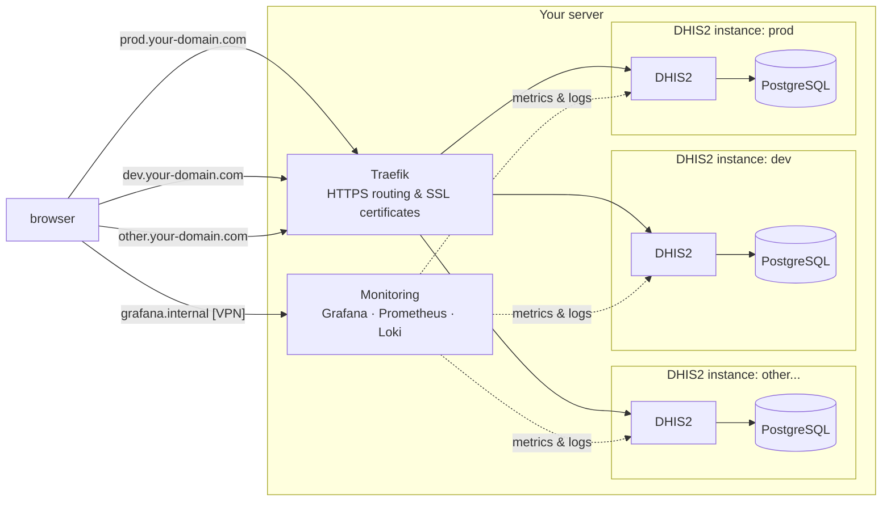

# DHIS2 Docker Deployment

> [!CAUTION]
> **Ready for public testing — not yet recommended for production or critical data.**
>
> The implementation is designed to meet production standards, but it needs more real-world testing before we can recommend it for critical data. Planning a production deployment? Read [project maturity](docs/guides/production-deployment.md#project-maturity) first. Feedback from the community is exactly what the project needs.

## Overview

This repository runs DHIS2 on Docker, from a throwaway demo on your laptop to a managed server hosting several instances side by side. Every instance gets its own PostgreSQL database, its own isolated Docker network, and its own HTTPS hostname; Traefik (reverse proxy and certificates) and the monitoring stack (Grafana, Prometheus, Loki) are started once per host and shared between all of them.

Everything is driven by `make` targets over Docker Compose. Adding an instance is two commands, and Traefik and Prometheus pick it up automatically — no restart of the shared stacks.


```mermaid
flowchart LR
    Browser["browser"]

    subgraph server["Your server"]
        direction TB
        Traefik["Traefik<br/>HTTPS routing & SSL certificates"]

        subgraph inst3["DHIS2 instance: other..."]
            direction TB
            App3["DHIS2"]
            DB3[("PostgreSQL")]
            App3 --> DB3
        end

        subgraph inst2["DHIS2 instance: dev"]
            direction TB
            App2["DHIS2"]
            DB2[("PostgreSQL")]
            App2 --> DB2
        end

        subgraph inst1["DHIS2 instance: prod"]
            direction TB
            App1["DHIS2"]
            DB1[("PostgreSQL")]
            App1 --> DB1
        end

        Mon["Monitoring<br/>Grafana · Prometheus · Loki"]
    end

    Browser -->|"prod.your-domain.com"| Traefik
    Browser -->|"dev.your-domain.com"| Traefik
    Browser -->|"other.your-domain.com"| Traefik
    Browser -->|"grafana.internal [VPN]"| Mon
    Traefik --> App1
    Traefik --> App2
    Traefik --> App3
    Mon -. "metrics & logs" .-> App1
    Mon -. "metrics & logs" .-> App2
    Mon -. "metrics & logs" .-> App3
```

## Choose your path

The guides below are complete, self-contained walkthroughs. Pick the one that matches what you are doing — they differ in how much operational machinery they ask you to set up, not in how DHIS2 itself is run.

| If you are…                                                                             | You will get                                                                                                              | Time    | Start here                                                     |
|:--|:--|:--|:--|
| **Running DHIS2 as a service** for an organisation, on infrastructure you must maintain | A hardened server, one or more instances on real domains, monitoring, VPN-gated admin UIs, backups                        | ~2h     | [Production deployment](docs/guides/production-deployment.md)   |
| **Hosting DHIS2 for a small team**, and want it secure without running a platform       | A single instance on your own domain with trusted HTTPS and working backups, and none of the production-scale operations   | ~30 min | [Simple deployment](docs/guides/simple-deployment.md)           |
| **Trying DHIS2 out** to see what it can do                                              | DHIS2 on your laptop, pre-loaded with the Sierra Leone demo database, so there is real metadata and data to click through  | ~20 min | [Demo environment](docs/guides/demo-environment.md)             |
| **Testing** a DHIS2 version, an app, or a bug report                                     | One or more throwaway instances on your laptop, on the DHIS2 version you choose, disposable and isolated from each other   | ~15 min | [Test environment](docs/guides/test-environment.md)             |

Not sure? [Demo environment](docs/guides/demo-environment.md) is the fastest way to have DHIS2 running in front of you, and nothing in it has to be undone before you follow another guide.

## What gets deployed

| Component                   | Scope        | Purpose                                                        |
|:--|:--|:--|
| DHIS2 (`dhis2/core`)        | Per instance | The application                                                |
| PostgreSQL (PostGIS)        | Per instance | The instance's database, on its own isolated network           |
| Traefik                     | Per host     | HTTPS routing and Let's Encrypt certificates for all instances |
| Grafana, Prometheus, Loki   | Per host     | Metrics, logs and dashboards for all instances                 |
| Glowroot                    | Per instance | Java application performance profiler                          |
| Tempo + OpenTelemetry       | Per instance | Distributed request tracing                                    |
| WireGuard                   | Per host     | Private tunnel for reaching admin UIs that are not public      |

DHIS2 is the only thing published to the internet. Grafana and Glowroot are reachable only over the VPN, on `*.internal` hostnames.

## Command conventions

Three variables appear throughout every guide. Setting them correctly is most of what there is to know about the `make` interface.

| Variable                | What it does                                                                                                                                                |
|:--|:--|
| `PROJECT_NAME=<name>`   | Names the instance a command applies to. Everything for an instance lives in `instances/<name>/`. Required by every per-instance target.                    |
| `SUDO=`                 | Runs Docker **without** `sudo`. The default is `sudo docker`, which is the right posture on a server; on a laptop or dev container prepend `SUDO=` to opt out. |
| `COMPOSE_OPTS=-d`       | Starts containers detached, in the background. Without it, `make start-…` runs in the foreground and holds your terminal.                                    |

```shell
# On a server (default: docker runs via sudo, containers detached)
COMPOSE_OPTS=-d PROJECT_NAME=prod make start-instance

# On a laptop or dev container, where your user is in the docker group
SUDO= COMPOSE_OPTS=-d PROJECT_NAME=demo make start-instance
```

`make list-instances` shows every instance you have configured, its hostname, and how many containers it is running.

> [!WARNING]
> If you are upgrading from a previous version of this tool and have a `.env` file in the root of the repository, please remove it! Otherwise it may interfere with the project-based deployment mechanism, which keeps each instance's configuration in `instances/<name>/.env`.

## Documentation

### Guides — do a thing, start to finish

- [Production deployment](docs/guides/production-deployment.md) — provision and harden a server, run instances on real domains, with monitoring, VPN and backups.
- [Simple deployment](docs/guides/simple-deployment.md) — one secure instance on your own domain, minimal operational overhead.
- [Demo environment](docs/guides/demo-environment.md) — DHIS2 on your laptop with the Sierra Leone demo database.
- [Test environment](docs/guides/test-environment.md) — disposable instances for testing versions, apps and bug reports.

### Reference — look something up

- [Instance lifecycle](docs/reference/instance-lifecycle.md) — every `make` target, and what each one changes.
- [Environment variables](docs/reference/environment-variables.md) — every variable, generated from the compose files.
- [Architecture](docs/reference/architecture.md) — networks, isolation model, and how instances are routed and scraped.
- [Backup and restore](docs/reference/backup-restore.md) — database and file storage, including loading a demo dump.
- [Monitoring](docs/reference/monitoring.md) — the shared Grafana / Prometheus / Loki stack.
- [VPN access](docs/reference/vpn.md) — WireGuard setup, peer enrolment, and trusting the internal CA.
- [TLS certificates](docs/reference/tls.md) — Let's Encrypt, the staging CA, and self-signed local certificates.
- [PostgreSQL configuration](docs/reference/postgresql.md) — tuning the database.
- [Profiling and APM](docs/reference/profiling.md) — Glowroot and Tempo tracing.
- [Troubleshooting](docs/reference/troubleshooting.md) — symptoms, causes and fixes.

### Contributing

- [Contributing](docs/contributing.md) — development setup, the test suite, and regenerating the docs and diagrams.
- [Server provisioning](server-provisioning/) — the Ansible playbook that prepares a bare server.

## Community & Discussions

> [!TIP]
>
> ### 🤝 Join the Discussion
>
> For troubleshooting, configuration help, and community, please use the **DHIS2 Community of Practice**:
>
> - 🟦 **[Server Administration](https://community.dhis2.org/c/server-administration/33)** — General server topics.
> - 🔹 **[DHIS2 on Docker](https://community.dhis2.org/c/server-administration/docker/95)** — **Specific to Docker on DHIS2.**
> - 🔹 **[DHIS2 on Kubernetes](https://community.dhis2.org/c/server-administration/kubernetes/94)**
