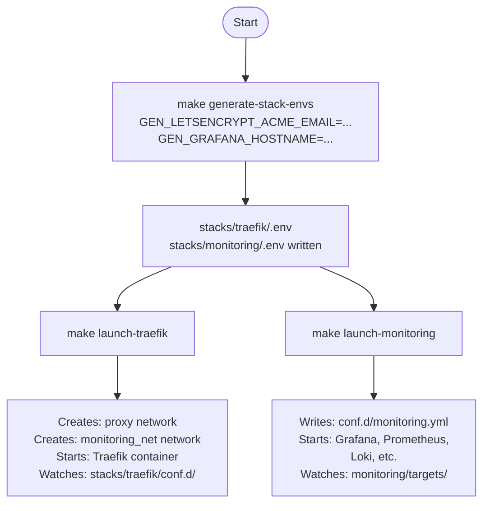
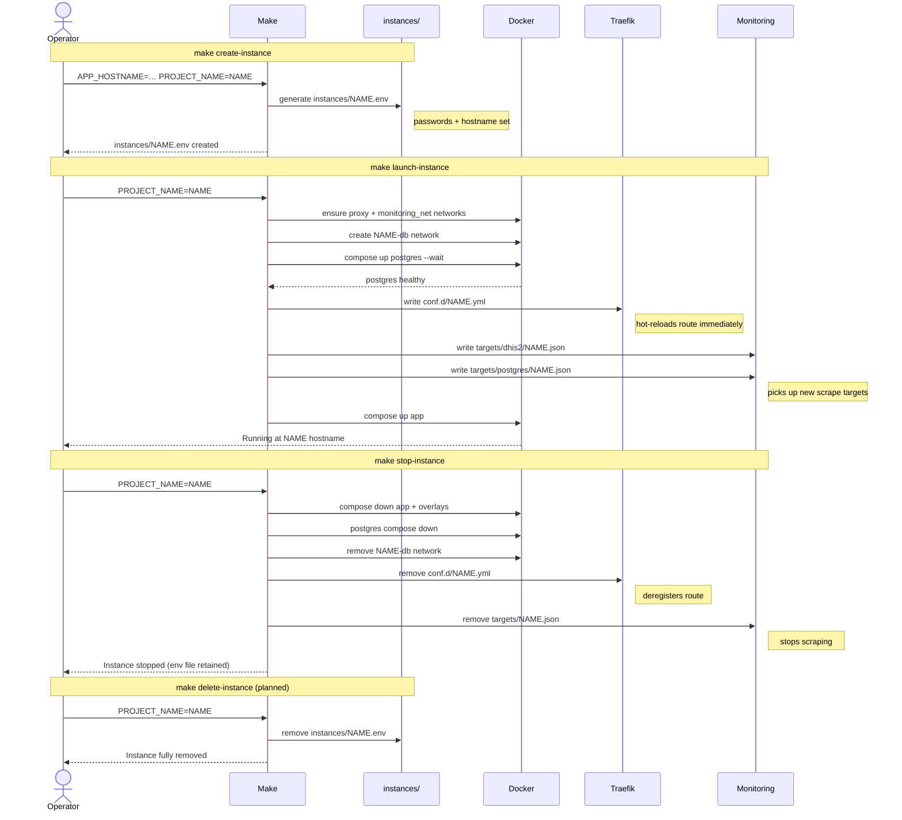
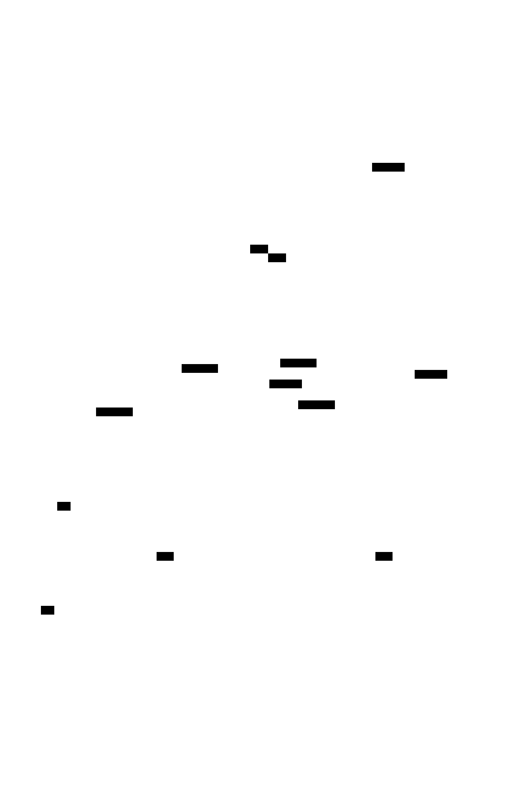

# Instance Management Workflows

A collection of useful process and architectural reference diagrams.

## 1. One-time server setup

Run once per host before creating any instances.



## 8. Instance lifecycle (sequence)



## Network architecture

### Docker network membership



| Service | proxy | monitoring_net | one-db | two-db |
|---|:---:|:---:|:---:|:---:|
| Traefik | ✓ | | | |
| one-app | ✓ | ✓ | ✓ | |
| two-app | ✓ | ✓ | | ✓ |
| one-postgres + exporter | | ✓ | ✓ | |
| two-postgres + exporter | | ✓ | | ✓ |
| Prometheus | | ✓ | | |
| Grafana | | ✓ | | |
| Loki | | ✓ | | |

### Generating the architecture SVG

The D2 source is at [`docs/architecture.d2`](./architecture.d2). It uses the [ELK](https://eclipse.dev/elk/) layout engine for cleaner routing of dense graphs.

#### Install D2

```bash
# macOS
brew install d2

# Linux / WSL
curl -fsSL https://d2lang.com/install.sh | sh
```

#### Generate the SVG

> **Note:** the DHIS2 CLI is also named `d2` and shadows the diagram tool in `$PATH`.
> Use the full path, or add an alias: `alias d2diagram=~/.local/bin/d2`

```bash
~/.local/bin/d2 docs/architecture.d2 docs/architecture.svg

```
