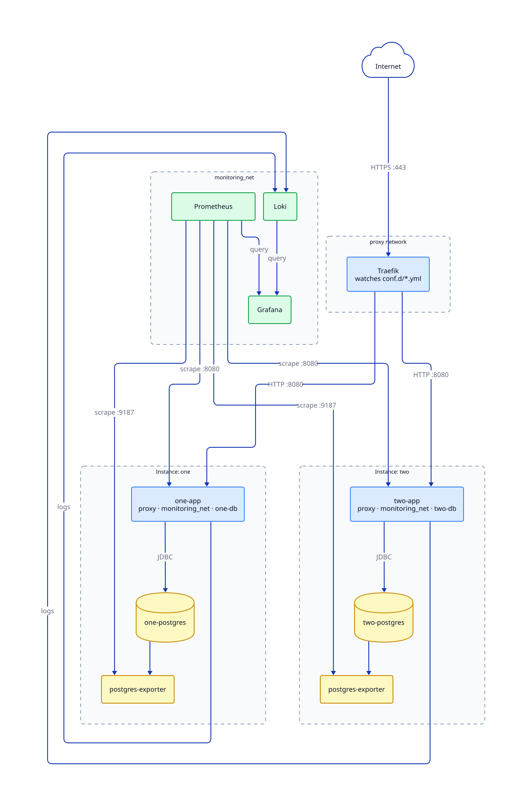

# Architecture

How the containers are arranged, which networks they join, and what is reachable from where.

## Shared and per-instance

The deployment separates what is shared by a host from what belongs to a single instance.

**Shared, started once per host:**

- **Traefik** — terminates TLS, obtains certificates, and routes each hostname to the right instance.
- **Monitoring** — Grafana, Prometheus, Loki, node-exporter and cAdvisor, collecting from every instance.
- **WireGuard** — the tunnel through which administrative interfaces are reached.

**Per instance, created and destroyed with it:**

- **DHIS2** and its **PostgreSQL** database.
- **postgres-exporter**, publishing database metrics for the shared Prometheus.
- **Tempo** and the OpenTelemetry agent, for request tracing, plus **Glowroot** inside the application container.
- One-shot jobs that set the admin password and create the monitoring user.

Adding an instance therefore adds containers but changes nothing about the shared stacks. They discover it from files, described in [service discovery](#service-discovery) below.



## Networks

| Network         | Scope        | Purpose                                                                                          |
|:--|:--|:--|
| `proxy`         | Host-wide    | Traefik reaching each instance's application container. Created by `ensure-networks`.            |
| `monitoring`    | Host-wide    | Prometheus and Loki reaching each instance's metrics and log endpoints. Created by `ensure-networks`. |
| `<name>-db`     | Per instance | The application and exporter reaching that instance's database. Created by `start-instance`.      |
| `application`   | Per instance | Internal traffic between the application and its one-shot jobs.                                  |

Membership, for two instances named `one` and `two`:

| Service                     | proxy | monitoring | one-db | two-db |
|:--|:--:|:--:|:--:|:--:|
| Traefik                     |   ✓   |            |        |        |
| one-app                     |   ✓   |     ✓      |   ✓    |        |
| two-app                     |   ✓   |     ✓      |        |   ✓    |
| one-postgres + exporter     |       |     ✓      |   ✓    |        |
| two-postgres + exporter     |       |     ✓      |        |   ✓    |
| Prometheus                  |       |     ✓      |        |        |
| Grafana                     |       |     ✓      |        |        |
| Loki                        |       |     ✓      |        |        |

The important line is that **`one-db` and `two-db` share no members**. An instance's database is reachable only by that instance's own containers, so a compromise of one application cannot reach another's data. Databases are not published to the host at all.

Containers reach each other by network alias rather than container name. Each instance's application is `<name>-app` on the `proxy` and `monitoring` networks, and its exporter is `<name>-postgres-exporter` on `monitoring`. Container names themselves are Compose-generated — `traefik-traefik-1`, for instance — which matters when you are reading logs.

## The request path

```text
browser ──▶ :443 Traefik ──▶ proxy network ──▶ <name>-app:8080
                │
                ├─ HTTP on :80 is redirected to HTTPS
                ├─ certificate from Let's Encrypt, per hostname
                └─ "security" middleware applied to public routes
```

Only Traefik publishes ports to the host: 80 and 443. Everything else is reachable only inside Docker networks, or through the VPN.

Administrative interfaces take a second path. Grafana and Glowroot are routed by the same Traefik, but on `*.internal` hostnames that resolve only inside the WireGuard tunnel, served with a self-signed certificate from a per-server authority. Those routes use a `security-internal` middleware — everything the public `security` middleware does except HSTS, which on a self-signed certificate would lock a browser out unrecoverably if it hit the route before trusting the authority. See [VPN access](vpn.md).

| Hostname                       | Service                | Reachable from |
|:--|:--|:--|
| `<your hostname>`              | DHIS2                  | The internet   |
| `grafana.internal`             | Grafana                | The VPN only   |
| `<name>.glowroot.internal`     | Glowroot, per instance | The VPN only   |

## Service discovery

Neither shared stack needs restarting when instances come and go, because both watch a directory.

- **Traefik** uses its file provider on `stacks/traefik/conf.d/`. `start-instance` renders a route file for the instance from a template; `stop-instance` deletes it. Traefik reloads within about a second.
- **Prometheus** uses file-based service discovery on `stacks/monitoring/targets/`, with a subdirectory for DHIS2 application targets and one for database exporters. Same pattern: written on start, removed on stop.
- **Loki** receives logs pushed by the Docker Loki log driver, which every container is configured to use. Logs are labelled with the instance name and container name, so they can be filtered per instance in Grafana.

One consequence: Traefik watches the route files but not the certificate files they refer to. On the VPN's first start the certificates do not exist yet, which is why `start-vpn` touches `conf.d/internal.yml` to force a reload.

## Container hardening

The compose files apply a consistent posture, worth knowing about because it explains some otherwise surprising behaviour.

- **Non-root users.** DHIS2 runs as uid 65534, Traefik and postgres-exporter as `nobody`.
- **All capabilities dropped**, and `no-new-privileges` set, on every service.
- **Read-only root filesystems** on the application, Traefik and the exporter, with `tmpfs` mounts for the paths that genuinely need writing — Tomcat's `temp`, `logs` and `work` directories, and `/tmp`. Anything a container writes outside a volume or tmpfs is lost on restart, by design.
- **Configuration mounted read-only**, per instance, from `instances/<name>/`.
- **No Docker socket access.** Traefik's Docker provider is disabled and its API is off; routes come only from files. Nothing in the deployment can control Docker through a mounted socket.

On a server provisioned by [server-provisioning](../../server-provisioning/), Docker additionally runs with user-namespace remapping, and operators stay out of the `docker` group and call Docker through `sudo`.

## Deliberate limits

Things the architecture does not currently do, which matter when planning a deployment:

- **No resource limits.** No CPU or memory limits are set on any container, so instances sharing a host can starve each other and one runaway query can affect everything on the box.
- **Tempo is shared in effect.** Each instance starts its own Tempo, but all of them join the `monitoring` network under the same `tempo` alias, which Docker DNS round-robins. Traces can be written to another instance's Tempo when several run at once.
- **One host.** There is no multi-host or high-availability story here. Traefik, monitoring and every instance live on a single machine.
- **Backups are local and manual.** `make backup` writes to the host's own disk, and neither scheduling nor off-host copying is provided.

## See also

- [Instance lifecycle](instance-lifecycle.md) — the targets that build this.
- [Monitoring](monitoring.md), [VPN access](vpn.md), [TLS certificates](tls.md).
- [Contributing](../contributing.md) — regenerating the architecture diagram from its D2 source.
