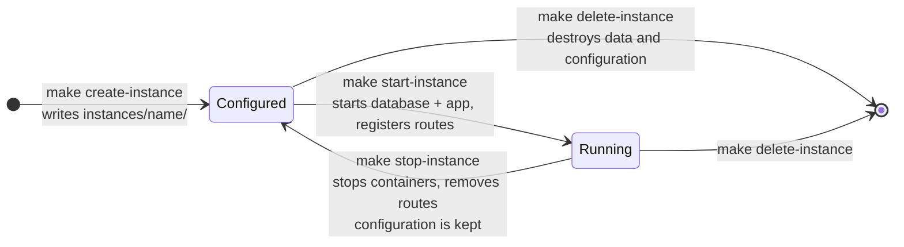
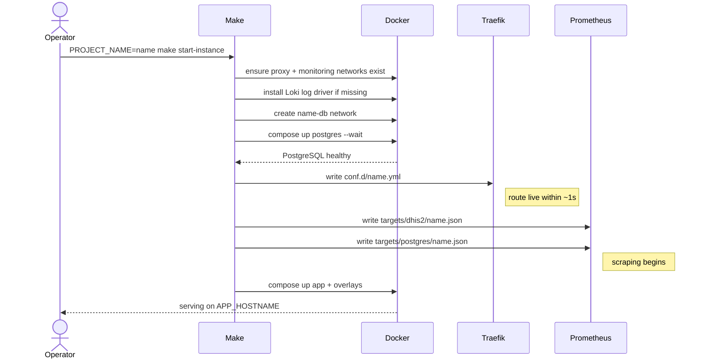

# Instance lifecycle

What each `make` target does, and what it changes on disk and in Docker.

## Variables

| Variable                | Default              | Applies to                | Purpose                                                                                                     |
|:--|:--|:--|:--|
| `PROJECT_NAME`          | the directory name   | All per-instance targets  | Names the instance. Used as the Compose project name; the instance's files live in `instances/<name>/`.      |
| `APP_HOSTNAME`          | —                    | `create-instance`         | The public hostname for the instance. Required.                                                             |
| `SUDO`                  | `sudo`               | Every target using Docker | Set to empty (`SUDO=`) to call Docker directly instead of through `sudo`.                                   |
| `COMPOSE_OPTS`          | —                    | `start-*` targets         | Appended to `docker compose up`, so it takes that command's own options — `-d` to detach, `--force-recreate`, `--no-deps`. It cannot add compose files: `-f` is a global flag on `docker compose` and has to precede `up`. |
| `BACKUP_DIR`            | `./backups/<name>`   | Backup and restore        | Where dumps are written and read from.                                                                      |
| `BACKUP_TIMESTAMP`      | UTC timestamp        | Backup                    | Overrides the generated filename stem.                                                                      |
| `DB_RESTORE_FILE`       | —                    | `restore-database`        | Dump filename, relative to `BACKUP_DIR`.                                                                    |
| `FILE_STORAGE_RESTORE_SOURCE_DIR` | —          | `restore-file-storage`    | File storage archive directory, relative to `BACKUP_DIR`.                                                   |

Because `PROJECT_NAME` defaults to the name of the directory you are in, always set it explicitly on per-instance targets. Forgetting it targets an instance named after your checkout.

## States

An instance is in one of three states.

- **Configured** — `instances/<name>/` exists with an env file and configuration. No containers, no routes, no data.
- **Running** — containers up, Traefik routing the hostname, Prometheus scraping it.
- **Deleted** — nothing left. Irreversible.

## Host setup targets

Run once per host, not per instance.

| Target                 | What it does                                                                                                                     |
|:--|:--|
| `generate-stack-envs`  | Writes `stacks/traefik/.env`, `stacks/monitoring/.env` and `overlays/wireguard/.env` with generated passwords. Requires `GEN_LETSENCRYPT_ACME_EMAIL`. Refuses to overwrite existing files. |
| `start-traefik`        | Creates the shared networks and volumes, then starts Traefik. Watches `stacks/traefik/conf.d/` for route changes.                |
| `clean-traefik`        | Stops and removes the Traefik containers. Volumes, including issued certificates, are kept.                                      |
| `start-monitoring`     | Starts Grafana, Prometheus, Loki, node-exporter and cAdvisor. Watches `stacks/monitoring/targets/` for new scrape targets.        |
| `clean-monitoring`     | Stops and removes the monitoring containers. Volumes, including collected metrics and logs, are kept.                            |
| `start-vpn`            | Starts WireGuard and its proxy, minting the `*.internal` certificates on first run.                                              |
| `stop-vpn`             | Stops the VPN. Peer configurations and certificates persist.                                                                     |
| `get-vpn-ca`           | Writes `rootCA.pem` to the current directory, for installing in a client's trust store.                                          |
| `ensure-networks`      | Creates the shared `proxy` and `monitoring` networks. Idempotent, and a prerequisite of the `start-*` targets, so rarely run directly. |
| `ensure-volumes`       | Creates the shared volumes. Same.                                                                                                |
| `install-loki-driver`  | Installs the Docker Loki log driver plugin if absent. Run automatically by `start-instance` and `start-vpn`.                      |

The three `.env` files created by `generate-stack-envs` are written `0600` and contain credentials. They are gitignored — keep them out of version control, and back them up somewhere safe, since the Grafana password and the shared monitoring credentials only exist there.

## Per-instance targets

| Target             | What it does                                                                                                                                   |
|:--|:--|
| `create-instance`  | Generates `instances/<name>/.env` with passwords and the given `APP_HOSTNAME`, and copies `config/dhis2/` and `config/postgresql/` into `instances/<name>/`. Refuses to run if either already exists. No containers are started. |
| `start-instance`   | See [below](#what-start-instance-does).                                                                                                        |
| `stop-instance`    | Brings the app, overlay and database containers down, removes the `<name>-db` network, and deletes the Traefik route and both Prometheus target files. Volumes and `instances/<name>/` are kept. |
| `delete-instance`  | Everything `stop-instance` does, plus removing the data volumes and the `instances/<name>/` directory. **Irreversible.** Prompts for confirmation when run interactively. |
| `list-instances`   | Prints every configured instance with its hostname and running container count.                                                                |
| `start-postgres`   | Creates the `<name>-db` network and starts only PostgreSQL, waiting for health. A prerequisite of `start-instance`.                             |
| `clean`            | Brings the app and overlay containers down, leaving PostgreSQL running and routes and targets in place. `stop-instance` is normally what you want. |
| `clean-all`        | Like `delete-instance` but keeps `instances/<name>/`, so the configuration and credentials survive while the data does not. **Irreversible.** Prompts when interactive. Despite the warning it prints, it does not touch the shared monitoring or Traefik volumes. |
| `config`           | Prints the fully resolved Compose configuration for the instance. Useful for checking what a variable actually evaluated to.                    |

### What `start-instance` does

The containers started for each instance are the application, PostgreSQL, `postgres-exporter`, `tempo`, and the one-shot `otel-init`, `glowroot-init`, `update-admin-password` and `create-monitoring-user` jobs. The profiling and Glowroot overlays are applied unconditionally — see [profiling and APM](profiling.md).

`update-admin-password` runs on **every** start, re-applying `DHIS2_ADMIN_PASSWORD` from the env file. This is what makes it safe to restore a database dump that carries its own users and still log in with a password you know. It also means a password you change inside DHIS2 is reset on the next `start-instance` unless you update the env file too.

Starting an instance is idempotent. Running `start-instance` against a running instance reconciles it with its configuration, which is how you apply a configuration change.

## Files an instance owns

| Path                                               | Written by        | Contains                                              |
|:--|:--|:--|
| `instances/<name>/.env`                            | `create-instance` | Hostname, versions, all generated credentials (`0600`) |
| `instances/<name>/dhis2/dhis.conf`                 | `create-instance` | DHIS2 configuration for this instance                 |
| `instances/<name>/postgresql/`                     | `create-instance` | PostgreSQL configuration for this instance            |
| `stacks/traefik/conf.d/<name>.yml`                 | `start-instance`  | The public route and the Glowroot internal route      |
| `stacks/monitoring/targets/dhis2/<name>.json`      | `start-instance`  | Prometheus scrape target for the application          |
| `stacks/monitoring/targets/postgres/<name>.json`   | `start-instance`  | Prometheus scrape target for the database exporter    |
| `backups/<name>/`                                  | `backup`          | Database dumps and file storage archives              |

Docker volumes hold the database, DHIS2 file storage, and each shared stack's data. They are named after the Compose project, so they survive `stop-instance` and are removed by `delete-instance` and `clean-all`.

## Development targets

Covered in [contributing](../contributing.md): `init`, `reinit`, `check`, `playwright`, `test`, `test-ui`, `docs`.

## See also

- [DHIS2 versions and upgrades](dhis2-versions.md) — choosing a version, and the upgrade procedure.
- [Architecture](architecture.md) — the networks these containers join and why.
- [Environment variables](environment-variables.md) — every variable in the compose files.
- [Backup and restore](backup-restore.md).
